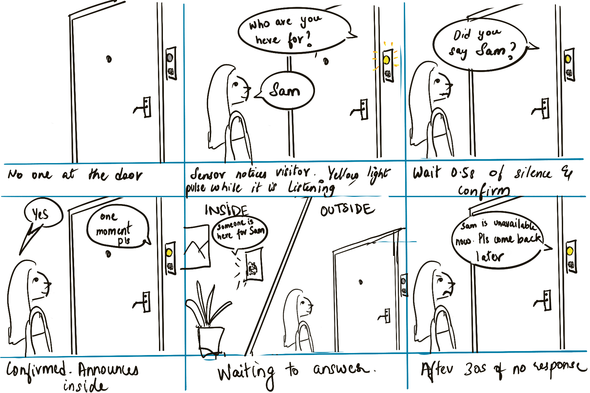
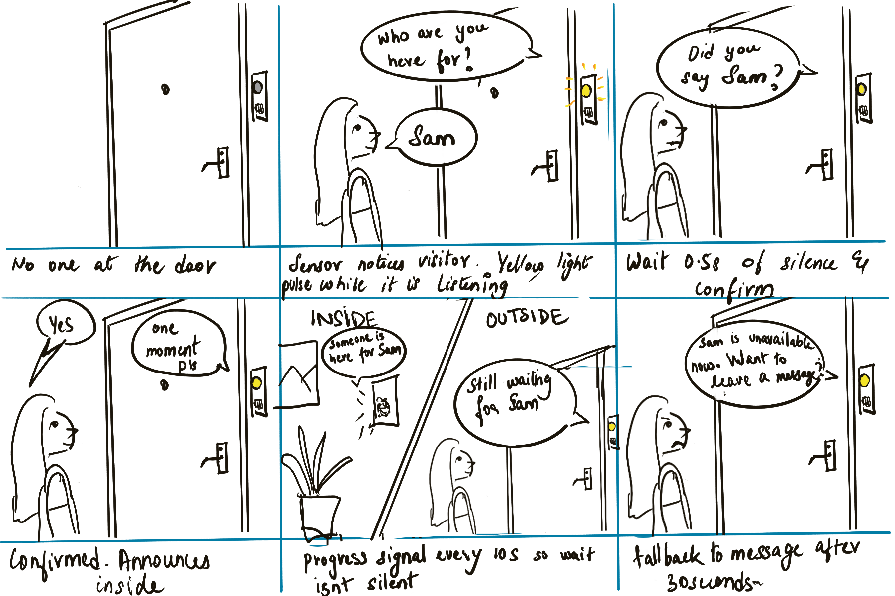

# Chatterboxes

**NAMES OF COLLABORATORS HERE**

[](https://youtu.be/LZ0VJClIlRI?si=Yy84mcyVYuVV19mn)

In this lab, we want you to design interaction with a speech-enabled device — something that listens and talks to you. This device can do anything *but* control lights (since we already did that in Lab 1). First, we want you to storyboard what you imagine the conversational interaction to be like. Then you will use wizarding techniques to elicit examples of what people might say, ask, or respond. We then want you to use the examples collected from at least two other people to inform the redesign of the device.

We will focus on **audio** as the main modality for interaction to start; these general techniques can be extended to **video**, **haptics** or other interactive mechanisms in the second part of the Lab.

A note on what you are building with. Speech interfaces are usually taught as two boxes — speech-in, speech-out — and that framing hides the part that actually determines whether an interaction works. Between listening and speaking sits the question of **whose turn it is**: when does the device decide you have finished talking, and how long does it make you wait before it answers? This lab gives you direct control over both, and we will ask you to notice what changes when you move them.

## Prep for Part 1: Get the Latest Content and Pick up Additional Parts

Please check instructions in [prep.md](prep.md) and complete the setup.

### Pick up Web Camera If You Don't Have One

Students who have not already received a web camera will receive their Webcam and at the beginning of lab. If you cannot make it to class this week, please contact the TAs to ensure you get these.

### Get the Latest Content

As always, pull updates from the class Interactive-Lab-Hub to both your Pi and your own GitHub repo.

**\[recommended\]** Option 1: On the Pi, `cd` to your `Interactive-Lab-Hub`, pull the updates from upstream (class lab-hub) and push the updates back to your own GitHub repo. You will need the *personal access token* for this.

```
pi@ixe00:~$ cd Interactive-Lab-Hub
pi@ixe00:~/Interactive-Lab-Hub $ git pull upstream Fall2026
pi@ixe00:~/Interactive-Lab-Hub $ git add .
pi@ixe00:~/Interactive-Lab-Hub $ git commit -m "get lab3 updates"
pi@ixe00:~/Interactive-Lab-Hub $ git push
```

Option 2: On your own GitHub repo, create a pull request to get updates from the class Interactive-Lab-Hub. After you have the latest updates online, go to your Pi, `cd` to your `Interactive-Lab-Hub` and use `git pull`.

---

# Part 1

## Setup

Create and activate a virtual environment for this lab:

```
pi@ixe00:~$ cd Interactive-Lab-Hub/Lab\ 3
pi@ixe00:~/Interactive-Lab-Hub/Lab 3 $ python3 -m venv .venv
pi@ixe00:~/Interactive-Lab-Hub/Lab 3 $ source .venv/bin/activate
(.venv) pi@ixe00:~/Interactive-Lab-Hub/Lab 3 $
```

Install the Python dependencies:

```
(.venv) $ pip install -r requirements.txt
```

This takes a few minutes. If you would like it to take considerably less time, [`uv`](https://docs.astral.sh/uv/) is a drop-in replacement for `pip` that is dramatically faster on the Pi:

```
(.venv) $ pip install uv && uv pip install -r requirements.txt
```

Then run the setup script, which installs the classic speech synthesizers, downloads the voice activity detection model, and pre-fetches a neural voice and a speech recognition model so you are not waiting on downloads during lab:

```
(.venv):~$ cd speech-scripts
(.venv) $ ./setup.sh
```

Check your audio devices before going further. `arecord -l` lists capture devices and `aplay -l` lists playback devices; if your webcam microphone or Bluetooth speaker does not appear, fix that first — every script below assumes the system defaults are the ones you want.

## A. Text to Speech

Your Pi can speak in several quite different ways, and the differences are audible in a way that matters for design. In `speech-scripts/` there are shell scripts for each.

### The classic engines

```
(.venv) $ cd speech-scripts

(.venv) $ sudo apt update
(.venv) $ sudo apt install -y espeak festival festvox-kallpc16k

(.venv) $ ./espeak_demo.sh
(.venv) $ ./festival_demo.sh
```

You can run these `.sh` files by typing `./filename`, and read one with `cat filename`. You can also play audio files directly with `aplay filename` — try `aplay lookdave.wav`.

These are all decades-old technology and they sound like it. `espeak-ng` is a *formant synthesizer*: it generates speech from an acoustic model of the vocal tract, which is why it sounds robotic but also why the whole thing fits in a couple of megabytes and responds instantly. `festival` is *concatenative*: they stitch together recorded fragments of a real speaker, which sounds more human but breaks audibly at the seams.

### Neural TTS with Piper

Note that the Piper command line changed in version 1.x — voices are now downloaded explicitly with `python3 -m piper.download_voices`, and you invoke it as `python3 -m piper`. Tutorials you find online may show the old `echo ... | piper --model ...` form, which no longer works. Browse the [voice samples](https://rhasspy.github.io/piper-samples) and download a different one if you'd like:

```
(.venv) $ python3 -m piper.download_voices en_US-lessac-medium
```

[Piper](https://github.com/OHF-Voice/piper1-gpl) synthesizes speech with a small neural network, runs comfortably on the Pi 5, and sounds markedly better than the above.

```
(.venv) $ ./piper_demo.sh
```

The demo script also shows `--output-raw`, which streams audio to the speaker as it is generated rather than writing a file first. Listen for the difference in how quickly speech begins. In a conversational system this gap is the thing your user experiences as responsiveness.

\*\***Write your own shell file to use your favorite of these TTS engines to have your Pi greet you by name.**\*\*
(This shell file should be saved to your own repo for this lab.)

\*\***Then answer: Is the same greeting, in these different voices, the same greeting? Describe one concrete way the voice changed what the utterance seemed to mean or who seemed to be speaking.**\*\*

### Part A: greeting script and voice comparison

**Script:** [`speech-scripts/greet.sh`](speech-scripts/greet.sh)

It greets me by name with Piper, streamed straight to the speaker so the first word comes out before the rest of the sentence is synthesized. The greeting picks "morning", "afternoon", or "evening" from the clock and reads out the current time. Flags play the identical line through the classic engines for comparison:

```
./greet.sh              # Piper (neural), my pick
./greet.sh --espeak     # formant synthesizer
./greet.sh --festival   # concatenative
```

The line every engine speaks: *"Good evening, Dhanushikka. Welcome back. It's 4:08 PM and your Pi is ready."*

**Is it the same greeting?** No. Same words, different speaker.

- **espeak**: flat pitch and clipped syllables make "Welcome back" sound like a status line, closer to "login successful" than to a hello.
- **festival**: more human but is fragmented.
- **Piper**: natural pitch movement, so "Good evening" rises and falls like a real greeting and the line feels addressed *to me*.

The concrete change: "Welcome back" is a *notification* in espeak and a *welcome* in Piper. The voice, not the text, decided which.

## B. Speech to Text

We use [faster-whisper](https://github.com/SYSTRAN/faster-whisper), a reimplementation of OpenAI's Whisper model that runs several times faster on CPU and does not require PyTorch. All processing happens on the Pi; nothing is sent to a server.

```
(.venv) $ python transcribe.py lookdave.wav
```

The transcript is not the interesting output here — the timings are. Run it again with a larger model and compare:

```
(.venv) $ python transcribe.py lookdave.wav --model base.en
(.venv) $ python transcribe.py lookdave.wav --model small.en
#  noted that the first run may take longer because the model is downloaded, and that the HF unauthenticated-request warning is expected and not an error.
```

Available sizes, smallest first: `tiny.en`, `base.en`, `small.en`, `medium.en`. The `.en` variants are English-only and faster than their multilingual counterparts at the same size.

\*\***Record a few seconds of your own speech (`arecord -d 5 -f cd -c 1 -r 16000 test.wav`) and transcribe it with at least two model sizes. Report the real-time factor for each. At what point does the accuracy improvement stop being worth the delay, for a system that has to answer you?**\*\*

### Part B: model size vs. latency

I recorded five seconds of myself saying *"Cinderella had to go home at midnight so she doesn't get caught."* and transcribed it with three model sizes (int8, greedy decoding) on the Pi 5:

| model | transcript | model load | transcription | real-time factor |
|---|---|---|---|---|
| tiny.en | correct, word for word | 0.53 s | 1.01 s | 0.20x |
| base.en | correct, word for word | 0.71 s | 2.13 s | 0.43x |
| small.en | correct, word for word | 1.21 s | 6.03 s | 1.21x |

**Where does accuracy stop being worth the delay?** For this sentence, immediately: all three transcripts were identical and correct, so `base.en` and `small.en` bought nothing and cost 2x and 6x the wait. `small.en` is too slow for a system that has to answer you. Its real-time factor is above 1, meaning it transcribes slower than people talk, so it falls further behind the longer you speak. A six-second silence after a five-second sentence reads as the device being broken. `tiny.en` answers within about a second, which is inside the range of a normal conversational pause. `base.en` is the only upgrade worth considering, and only if `tiny.en` starts making errors on harder input like names, numbers, or noisy rooms. It turns out it does, on numbers, as the next section shows.

\*\***Write your own script that verbally asks for a numerical input (a phone number, zipcode, number of pets) and records the answer the respondent provides.**\*\* Numbers are a good stress test — transcription systems make characteristic errors on digit strings, and you will want to know what they are before you design around them.

### Part B: asking for a number

**Script:** [`speech-scripts/ask_number.py`](speech-scripts/ask_number.py)

The device asks a question with Piper, records the answer for a fixed window, transcribes it with faster-whisper, pulls the digits out (converting number words like "six oh seven" to 607), and reads them back for confirmation. It prints both the raw transcript and the extracted digits, because the gap between them is where the characteristic errors show up.

```
python ask_number.py                                              # phone number
python ask_number.py --question "What is your zip code?" --seconds 4
python ask_number.py --question "How many pets do you have?" --seconds 3
```

**Digit errors observed.** Asked for my phone number, `tiny.en` returned 11 digits instead of 10: an extra `0` was inserted mid-string. The transcript came back as `400-879-937-06`, grouped in a pattern that doesn't match how phone numbers are said, which shows the model was guessing at the structure rather than hearing it. I never said that zero. To find out whether it was in the audio or in the model, I re-ran the saved recording through all three sizes:

| model | transcript of the same recording | digits | transcription |
|---|---|---|---|
| tiny.en | `400-879-937-06` | 11, wrong | 1.78 s (0.30x) |
| base.en | `4087993706.` | 10, correct | 1.72 s (0.29x) |
| small.en | `4087993706` | 10, correct | 4.85 s (0.81x) |

The zero was not in the audio. `tiny.en` inserts it every time on this recording, and both larger models get all ten digits right. So this is the small model guessing, and on a given input it guesses the same way each time. A fresh recording of the same number transcribed correctly with `tiny.en`, so across recordings the error comes and goes, but on a fixed input it is repeatable.

This revises the conclusion above: on a plain sentence the three models tied, but on a digit string `base.en` is worth it. It cost the same time as `tiny.en` here and was the difference between a usable and an unusable phone number.

Two design takeaways for a system that collects numbers:

- **Count the digits.** A phone number has exactly 10, a zip code exactly 5. If the count is wrong, the device should say so and re-ask instead of confirming a wrong number.
- **Read back and confirm.** The script already does this, but the read-back is what caught the error here. Without it a wrong number would have been silently accepted.

## C. Turn-taking: knowing when someone has stopped talking

Everything so far has worked on fixed audio files. A real conversational device does not get told when to start and stop recording — it has to decide. This is the problem that makes speech interfaces hard, and it is mostly not a speech recognition problem.

We use a **voice activity detector** (VAD) to segment the microphone stream into utterances. `listen.py` runs Silero VAD continuously and hands each detected utterance to faster-whisper:

```
(.venv) $ cd speech-scripts
(.venv) $ python listen.py
```

Speak, pause, and watch it transcribe. Now change the endpointing threshold — the amount of silence the system requires before it decides your turn is over:

```
(.venv) $ python listen.py --min-silence 0.2
(.venv) $ python listen.py --min-silence 1.5
```

\*\***Try both extremes, and something in between. Describe what each one feels like to talk to. Note specifically: at 0.2s, what kinds of normal speech get cut off? At 1.5s, what does the delay make the system seem like?**\*\*

There is no correct value. A system that takes drink orders and a system that listens to someone think out loud want very different thresholds, and the right one depends on what your users are doing with their pauses.

### Part C: endpointing thresholds

I tried `listen.py` at 0.2 s, 0.5 s, and 1.5 s of silence.

- **1.5 s** feels like a long time for a conversation. The wait after you stop talking feels like forever, and the system seems slow to respond.
- **0.2 s** feels more real-time, but things get cut off. If the person isn't actually pausing for a break and is just having a regular conversation, a normal breath between phrases is enough to end their turn. 0.2 s is too short to assume someone is done talking.
- **0.5 s** seemed more normal. It still responds quickly but doesn't cut in mid-sentence.

### The complete loop

`echo_bot.py` puts the pieces together: it listens, endpoints, transcribes, and speaks a reply through Piper. The dialogue policy is deliberately trivial — it repeats what you said — so that everything you notice is a property of the timing rather than the content.

```
(.venv) $ python echo_bot.py
```

## D. Storyboard

Storyboard and/or use a Verplank diagram to design a speech-enabled device. (Stuck? Make a device that talks for dogs. If that is too stupid, find an application that is better than that.)

\*\***Post your storyboard and diagram here.**\*\*

Write out what you imagine the dialogue to be. Use cards, post-its, or whatever method helps you develop alternatives or group responses.

\*\***Please describe and document your process.**\*\*

Your script should include the pauses. Where does your device wait, and for how long? You now know from Part C that this is a parameter you have to choose, not something that happens for free.

### Part D: the Door Greeter

A small box by the front door of a shared apartment. When someone arrives, it asks who they're here for, announces them to that person, and lets the visitor know whether to wait. It has to get a *name* right, which is the same problem as the phone number in Part B: names are short, easy to mishear, and wrong guesses are embarrassing rather than harmless.

**Storyboard**

First iteration, drawn before acting it out:



1. No one at the door. The greeter sits beside the door, light off.
2. The proximity sensor notices a visitor. The greeter asks "Who are you here for?" and its yellow light pulses while it listens. The visitor says "Sam."
3. The greeter waits 0.5 s of silence, then confirms: "Did you say Sam?"
4. The visitor says "Yes." The greeter says "One moment please" and announces inside.
5. Inside, a speaker says "Someone is here for Sam." Outside, the visitor waits.
6. After 30 s with no response, the greeter says "Sam is unavailable now. Please come back later."

**Script with pauses**

```
[visitor detected by proximity sensor, yellow light pulses]
Device:   Who are you here for?
          [listens; ends the visitor's turn after 0.5 s of silence]
Visitor:  Sam.
          [0.3 s thinking pause, light solid]
Device:   Did you say Sam?
          [waits up to 3 s for an answer]
Visitor:  Yes.
          [0.3 s]
Device:   One moment please.
          [announces inside: "Someone is here for Sam."]
          [waits up to 30 s for the door to open]
Device:   Sam is unavailable now. Please come back later.
          [light off]
```

Fallback branch when the name is misheard:

```
Device:   Did you say Sam?
Visitor:  No, Pam.
          [0.3 s]
Device:   Did you say Pam?
Visitor:  Yes.
```

After two misses in a row:

```
Device:   Sorry. The people here are Sam, Pam, and Nicole. Which one?
```

**Where it waits, and why**

- *0.5 s to end the visitor's turn.* From Part C. 0.2 s cut people off mid-phrase, 1.5 s felt like forever. A name is short, so the shorter side of normal is fine.
- *0.3 s before replying.* Just enough that the confirmation doesn't sound like it interrupted. Longer than that starts to feel like the device is unsure.
- *3 s for yes/no.* A yes or no comes fast. If nothing comes in 3 s the visitor probably didn't realize it was a question, so the device re-asks.
- *30 s for the door.* The one long wait. The visitor can see the door, so silence here is the resident's delay, not the device's, but the device still has to say something eventually so the visitor knows it hasn't given up.

**Process**

I started from the Part B finding that the transcriber inserts or drops tokens on short, unpredictable inputs. A name is exactly that kind of input, so the design puts a confirmation step in the middle of every exchange rather than trusting the first transcription. I then wrote the happy-path script, and worked out the branches by asking at each device line "what if the answer is wrong, and what if there's no answer at all?" Every wait in the script has a timeout with a spoken fallback, so the visitor is never left in silence wondering whether the device is still working. The 0.5 s threshold came straight from Part C. The 30 s wait is the one number I couldn't derive from anything measured; it's a guess about how long a resident takes to reach the door, and Part E should tell me whether it's right.

## E. Acting out the dialogue

Find a partner, and *without sharing the script with your partner* try out the dialogue you've designed, where you (as the device designer) act as the device you are designing. Please record this interaction (for example, using Zoom's record feature).

\*\***Describe if the dialogue seemed different than what you imagined when it was acted out, and how.**\*\*

### Part E: acting it out

I played the device; my partner played a visitor and had not seen the script.

**Recording:** [Video: acting out the Door Greeter dialogue](https://drive.google.com/file/d/16wWgM2ZhMZ7hJdzRUEUKdU1ljXp_-Cry/view?usp=drive_link)

What actually happened, with timestamps from the recording:

```
 0 s  Device:   Who are you here to see?
 3 s  Visitor:  Sam.
 6 s  Device:   Did you say Sam?
 8 s  Visitor:  Yes.
11 s  Device:   One moment.
15 s  Visitor:  How long does this take?
21 s  Visitor:  It's taking a little too long.
26 s  Device:   Sam is not answering the door. Please come back later.
32 s  Visitor:  But I know he's in there.
```

**How it differed from what I imagined**

- **The name exchange worked as designed.** Ask, answer, confirm, yes, in about 8 seconds with no confusion. The confirmation question didn't feel awkward when spoken, which I'd worried about.
- **The long wait is where the design broke.** The script has the device silent for up to 30 s while the resident comes to the door. My partner lasted about 4 s before asking "How long does this take?", then complained again 6 s later. The device had no line for talk during the wait, so I stayed silent, which is what made the visitor feel ignored. The wait needs a progress signal, something like "Still waiting for Sam" every 10 s or so, or at least a listening light.
- **The ending gives the visitor nothing.** "Please come back later" closes the interaction without offering anything, and the visitor had no way to respond to it. An option like "Want to leave a message?" would give them a next step.
- **The visitor pushed back and the device had nothing.** "But I know he's in there" is a normal thing to say, and the script has no branch for it. The visitor doesn't accept the device's conclusion just because the device said it.

**Conclusion:** the parts I designed carefully worked, and the part I hand-waved, the 30 s wait, was where the interaction fell apart. Silence from a device reads as the device not working, even when the silence is intentional.

---

# Lab 3 Part 2

For Part 2, you will redesign the interaction with the speech-enabled device using the data collected, as well as feedback from part 1.

## Prep for Part 2

1. What are concrete things that could use improvement in the design of your device? For example: wording, timing, anticipation of misunderstandings.
2. What are other modes of interaction *beyond speech* that you might also use to clarify how to interact? In particular: how does someone know when the device is listening, and when it is thinking? You have a screen and an LED.
3. Make a new storyboard, diagram and/or script based on these reflections.
4. (optional) Integrate [input devices](inputs.md) in the system

### Part 2 prep

**1. What could be improved**

From Part E, the name exchange worked and the wait did not. The changes:

- *Timing.* The device goes silent for up to 30 s after "One moment." The visitor started asking questions after 4 s. Add a progress line, "Still waiting for Sam," every 10 s so the wait is never silent.
- *Wording.* "Please come back later" ends the conversation with nothing for the visitor to do. Replace it with "Want to leave a message?" so there is a next step.
- *Anticipating misunderstandings.* The visitor pushed back with "But I know he's in there." The device needs a line for disagreement, even if it's just "I'll try once more" followed by a second announcement inside.
- *Talk during the wait.* The device ignored everything said while waiting. It should at least acknowledge it: "I heard you. Still waiting for Sam."

**2. Beyond speech: showing listening and thinking**

The kit has a yellow LED on the greeter in the storyboard, and the Pi has the MiniPiTFT screen and two Qwiic buttons with red and green LEDs. Plan:

- *Listening:* the LED pulses, and the screen shows a microphone icon. The pulse starts when the proximity sensor fires, before the device speaks, so the visitor knows it noticed them.
- *Thinking:* the LED goes solid and the screen shows "..." for the 0.3 s before the device replies. Short, but it separates "heard you" from "answering you."
- *Waiting for the resident:* the screen shows a countdown from 30. That replaces most of the need for spoken progress lines, since the visitor can see something is happening.
- *Confirming a name:* the screen prints the name it heard in large text while it asks "Did you say Sam?" A visitor who can read the name can catch a mishear before answering.
- *Buttons as a backup:* the green button means yes and the red means no, for a visitor who would rather not talk to the box, or when the mic mishears "yes" twice.

**3. Revised storyboard**



Frames 1 through 4 are unchanged. Frame 5 adds the progress signal every 10 s so the wait isn't silent. Frame 6 replaces "come back later" with the offer to leave a message.

Revised script, changes marked with `*`:

```
[visitor detected by proximity sensor, LED pulses, screen shows mic icon]
Device:   Who are you here for?
          [0.5 s of silence ends the visitor's turn]
Visitor:  Sam.
          [0.3 s, LED solid, screen shows "Sam"]                        *
Device:   Did you say Sam?
          [waits up to 3 s; green button also means yes]                *
Visitor:  Yes.
Device:   One moment please.
          [announces inside; screen counts down from 30]               *
          [every 10 s:]                                                 *
Device:   Still waiting for Sam.                                        *
          [if the visitor speaks during the wait:]                      *
Device:   I heard you. Still waiting for Sam.                           *
          [after 30 s with no door:]
Device:   Sam is unavailable now. Want to leave a message?              *
          [waits up to 5 s]
Visitor:  Yes.
Device:   Go ahead, I'm recording.
          [records until 1.5 s of silence, the long threshold from Part C, *
           since people pause while composing a message]
Device:   Got it. I'll pass that on.
```

## Prototype your system

The system should:
* use the Raspberry Pi
* use one or more sensors
* require participants to speak to it

*Document how the system works.*

*Include videos or screencaptures of both the system and the controller.*

## Test the system

Try to get at least two people to interact with your system. (Ideally, you would inform them that there is a wizard *after* the interaction, but we recognize that can be hard.)

Answer the following:

### What worked well about the system and what didn't?
\*\**your answer here*\*\*

### What worked well about the controller and what didn't?
\*\**your answer here*\*\*

### What lessons can you take away from the WoZ interactions for designing a more autonomous version of the system?
\*\**your answer here*\*\*

### How could you use your system to create a dataset of interaction? What other sensing modalities would make sense to capture?
\*\**your answer here*\*\*

<details>
  <summary><strong>Submission Cleanup Reminder (Click to Expand)</strong></summary>

  **Before submitting your README.md:**
  - This readme.md file has a lot of extra text for guidance.
  - Remove all instructional text and example prompts from this file.
  - You may either delete these sections or use the toggle/hide feature in VS Code to collapse them for a cleaner look.
  - Your final submission should be neat, focused on your own work, and easy to read for grading.
</details>
